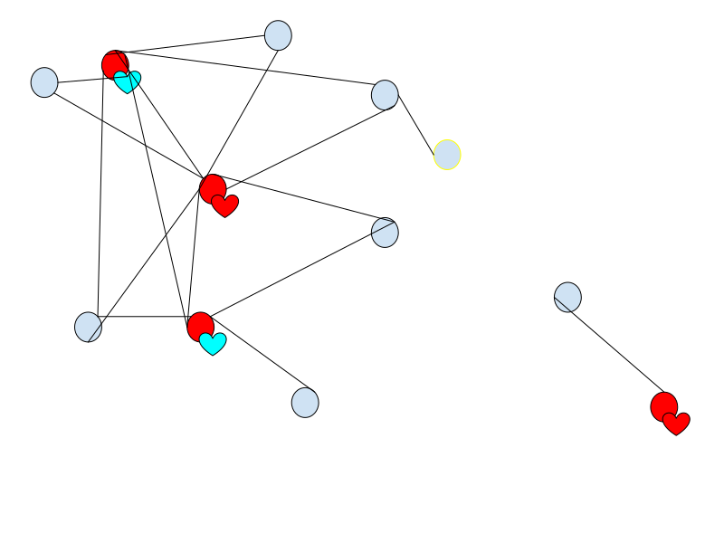

# Dither Chat

- [Dither Chat](#dither-chat)
	- [What is it](#what-is-it)
	- [Users & Sync](#users--sync)
	- [Chat Events](#chat-events)
	- [Event Storage - Storage of a sequence of events in memory or storage](#event-storage---storage-of-a-sequence-of-events-in-memory-or-storage)
	- [Trusted Friends Application API](#trusted-friends-application-api)
	- [Chat Interface](#chat-interface)
	- [Direct Messaging](#direct-messaging)
	- [Group messaging](#group-messaging)
	- [Servers](#servers)

## What is it
Dither Chat is a decentralized communication application using the Dither protocol. Servers are communally hosted with local consensus. Bots and plugins will be supported and also communally hosted.
tl;dr Discord but decentralized and better.

## Users & Sync
 - Each user may have multiple Peers (devices that Dither is installed on)
 - Chat Event history can be optionally synced across Peers.
 - A peer may host multiple users
 - Each UserId must have at least 1 peer that hosts it.

## Chat Events
- All Events are signed with the private key of the person who sent it (these will be verified with a config option to let through or ignore unsigned or incorrectly signed events)
- Chat Message structure
  - Date sent, last edited, markdown data / embed json, UserID mentions, emoji reactions
- Rich Presence (updating custom statuses and online/offline status)
  - Optional storage - can store presence update history (off by default)
  - Optional sending, extracts information about what you are currently doing and updates your friends. (on by default)
  - Customization options to only share with certain friends
## Event Storage - Storage of a sequence of events in memory or storage
  - Stored as hash-linked local blocktree that messages are added to and new blocks are created when a certain amount of time elapses between the last message sent or max block size exceeded. Block size can be set to 1 to prevent messages being ordered out-of-order.
  - Indexing can be done on a by-block level (TODO: more customization options needed)
  - Block structure can allow for thread branching & thread conversation movement across users. (e.g. create a group dm on top of an ongoing conversation)

## Trusted Friends Application API
- Option to rank friends manually or by how much you chat with them
- Can mark friends as “Trusted, Neutral or Untrusted”
- Friend rank can be used by other applications
- e.g. for Stellar Consensus Protocol quorum selection
## Chat Interface
- Built-in markdown formatting + advanced chat box (similar to discord)
- Link Displaying
- Metadata can be sent so receiver doesn’t have to send request to web pages
- TODO: Do we need to worry about invalid metadata being sent, tricking the user? Perhaps just scanning for suspicious domains is enough.
- Receivers can choose if they want to fetch link data, only fetch commonly used sites (e.g. youtube, twitter, soundcloud etc.) or not fetch anything at all and only display sent link metadata
## Direct Messaging
- Simply sending JSON-encoded message/other events to UserID on Dither
## Group messaging
- Messages are broadcast over gossipsub and conflicting blocks are ordered by time.
## Servers
- Servers are communially hosted by the moderaters computers. However, the owner has full control over the server and can choose who can assist 
- Red Nodes are hosting nodes, blue nodes are members. Blue node with yellow stroke is proxying it's connection to the server
- 