# A visual walkthrough

What the models in this folder look like, in the order the research built them: the play-dough city, the
one model drawn as a city and as a layer of neurons, and the learners drawn as economies. Each picture
says how to read it, what it shows, and where the details are.

The screenshots come from the interactive pages, so opening them shows the same thing, moving. The
other figures are drawn straight from the engines, with the same seeds as the tests. [How they were
made](#how-these-pictures-were-made) is at the end.

## 1. The play-dough city

The research started from a video in which a lid pressed on a lump of play-dough stands for height
limits pressing a city outward. [`experiments/playdough-city/`](experiments/playdough-city/) replaces the
play-dough with the standard economic model of a city, and these are the first three steps of its tour.

**No rules.** Each block's volume is the floor space built on that parcel (heights are exaggerated 360×).
Left alone, the city is a smooth, mostly low-rise mound.

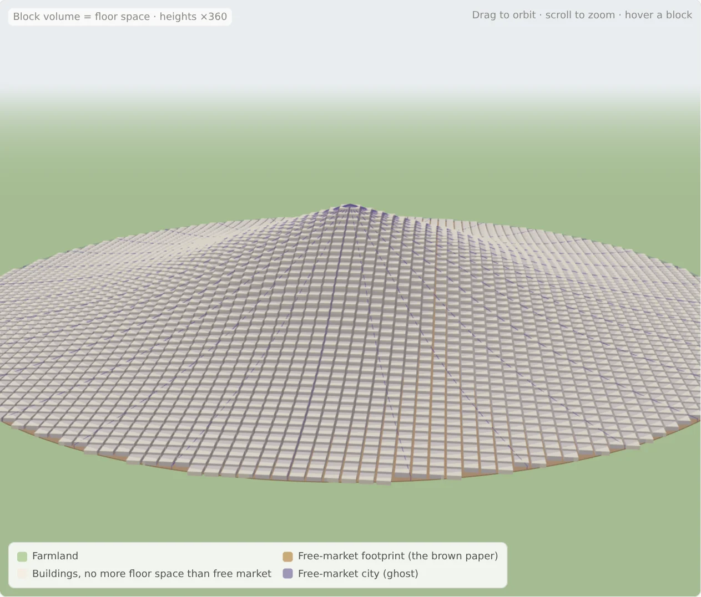

**A lid.** A 1-story height limit. The purple wireframe is the free-market city from the first picture.
Orange marks suburbs that got denser; blue marks sprawl onto former farmland. With fixed home sizes and
nobody leaving, the city covers 45% more land
([doc 1](docs/1-height-limits-and-sprawl.md#what-it-found)).

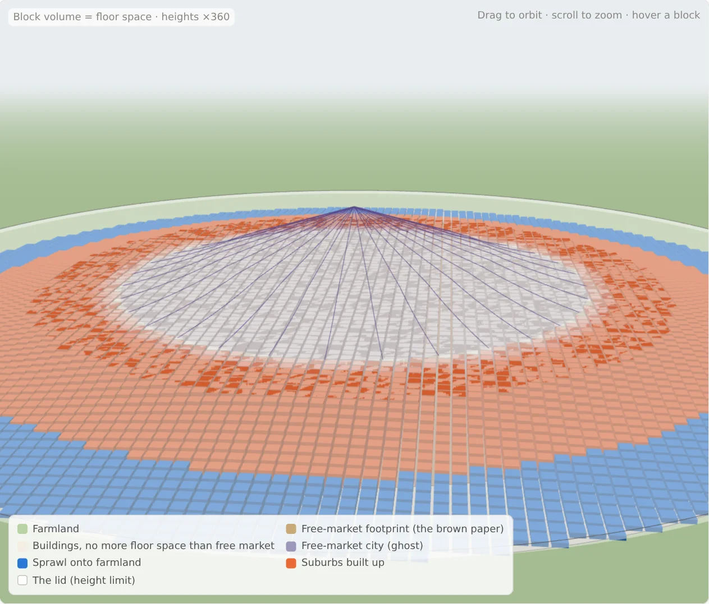

**A hole in the lid.** Downtown is exempt (green). It does build taller than it would with no rules at all,
but only to about 5 stories here, not the supertall towers the video shows.

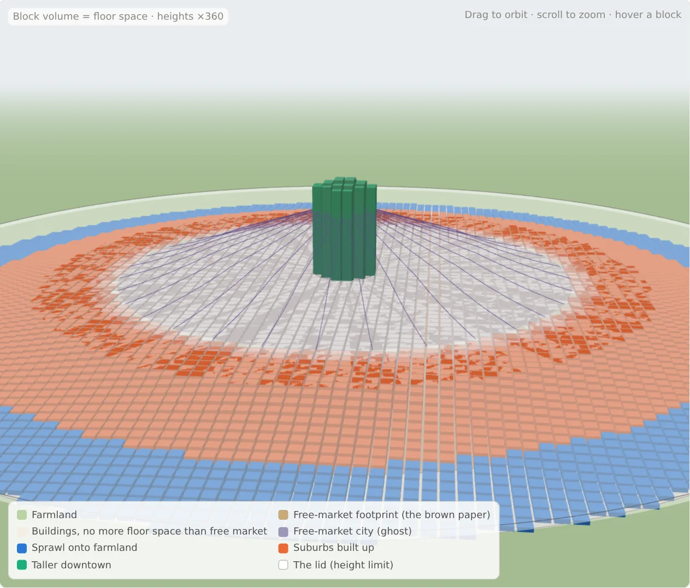

## 2. One model, two readings

[`experiments/one-model/index.html`](experiments/one-model/index.html) runs one simulation and draws it
twice. Agents arrive one at a time, each picks a site, stays a while and leaves; a site's price rises with
how many are there. On the **left** it's a city: tiles are parcels, each floor is one household living
there now. On the **right** it's one layer of neurons: each disc is a neuron, and its size is how many of
its recent spikes are still in effect, which is also how "tired" (adapted) it is. The same agents move in
both pictures; [doc 3](docs/3-one-model-two-readings.md) says why each pairing is exact.

**The land market.** Households set out from downtown (the pin) and take the best deal: a short commute
and low rent. Rent rises with the floors in use, so the centre builds up and rents fall with distance
until land stays farmland. On the right, the input neuron fires spikes into the layer; nearby neurons win
more often, and each win makes a neuron harder to win again, so activity spreads outward until distant
neurons stay silent. Rent is the neuron's adaptation, number for number. One thing is given here that a
real city or cortex builds itself: the pin. The next three settings take it away.

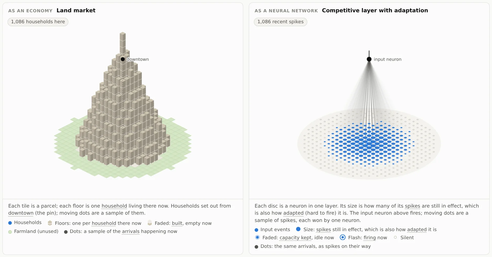

### No centre given

**A downtown forms by itself.** No pin. Each household wants to be near the others it deals with, within a
reach, and pays rent; each spike goes to a neuron near the neurons its population reads from, and tires the
winner. From a flat plain a centre forms on its own, marked by the dashed ring, with rent and density
falling away from it just as from a given downtown. On a bounded plain it forms in the middle, the most
accessible spot. The network reading is a neural field: local excitation plus adaptation holds a bump of
activity wherever it happens to start ([doc 6 §19](docs/6-derivations.md#19-a-centre-that-isnt-given-agglomeration--wiring-economy)).

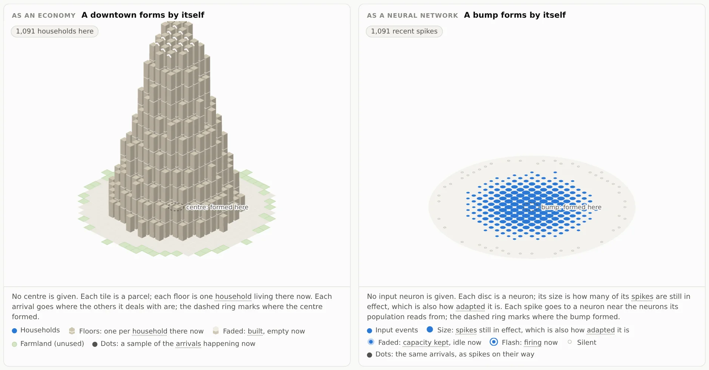

**A harbour moves it.** The same setting with one pinned feature off-centre, pulling a tenth as hard as the
land market's commute. The whole city moves to the coast; the whole bump moves under the input. Geography
decides where a centre forms; the agglomeration does the rest.

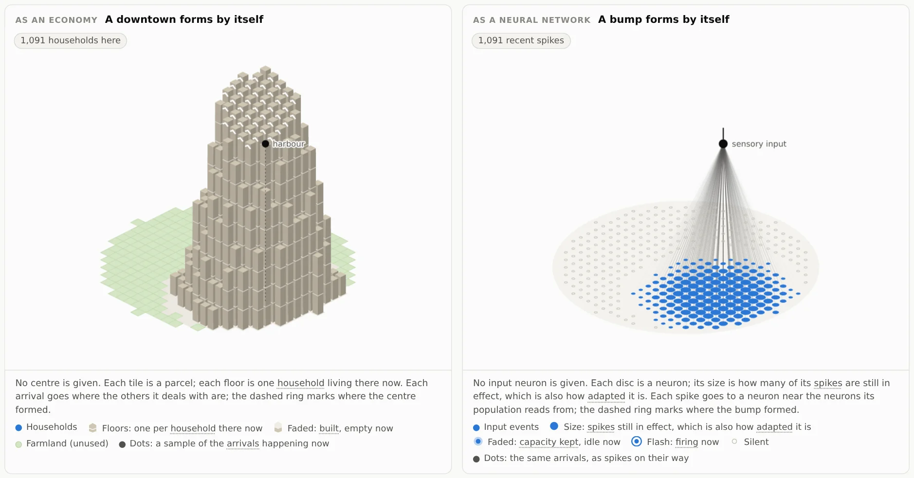

**The map says what will form.** Under the agglomeration setting the chart is a map computed from the two
kernels alone: pull on one axis, competition on the other, grey where a flat plain stays flat, blue where
it gathers into one centre, orange where it breaks into towns, and the current knobs as a dot. Below it is
the density by distance from the centre that formed; its gradient (Clark's β) is in the readout, and comes
out as about one over the reach ([doc 6 §21](docs/6-derivations.md#21-what-the-kernels-predict-a-regime-map-and-the-density-gradient)).

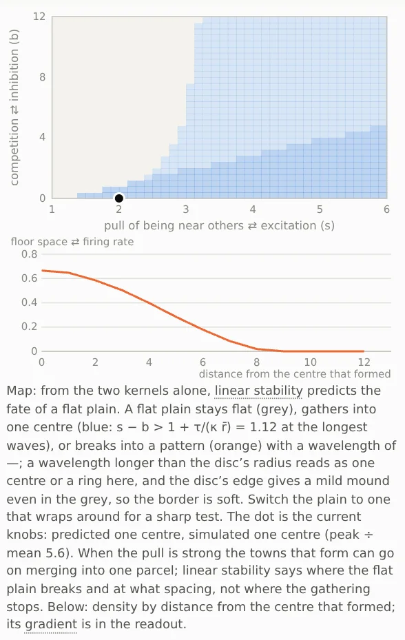

**A plain with no edge.** The disc's rim makes a mound even when the map says flat, so a knob makes the
plain wrap around instead (a torus). There the flat plain is an exact equilibrium, and the bump forms
wherever the first ripple was largest, here across the plain's wrap-around edge: on a plain with no
landmark, history picks the spot.

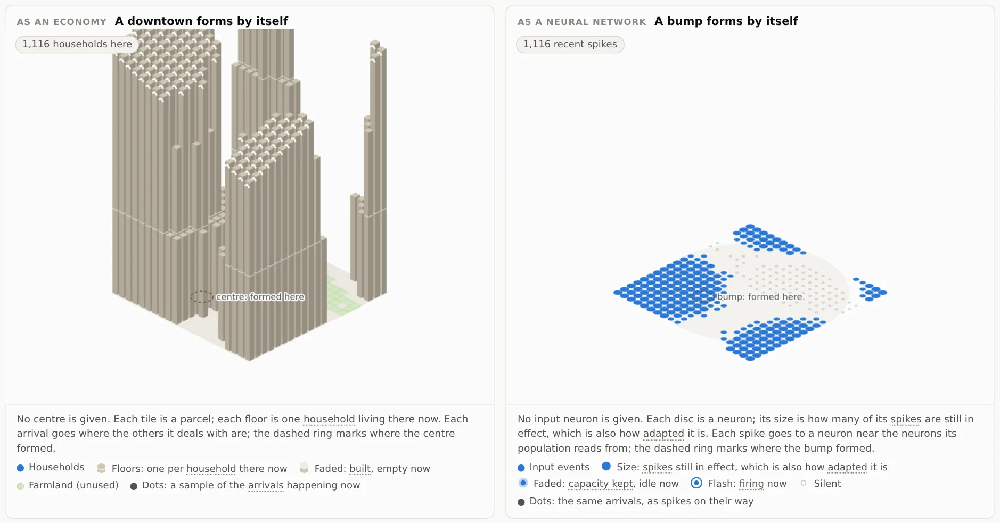

With a short reach and strong competition the map predicts that the two-bumps-per-side wave grows fastest,
so four towns; four towns form, and the profile about one of them shows the others at the predicted spacing.

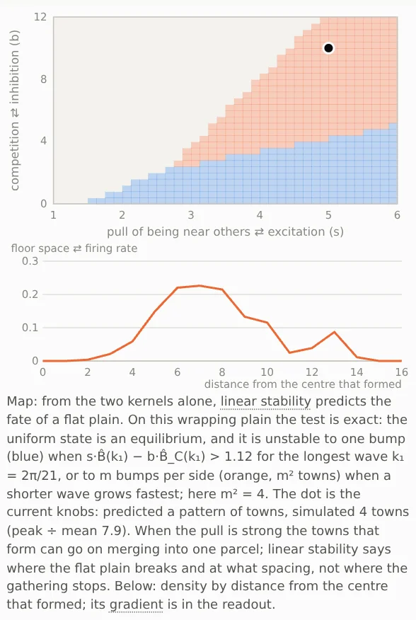

The figure below is the whole map for two reaches, with eight runs of the model marked: a dot where the
outcome matched and a cross where it did not. The two crosses are settings where the plain did break into
towns as predicted, and the towns then merged until one parcel held everything: the map predicts where a
flat plain breaks and at what spacing, not where the gathering stops.

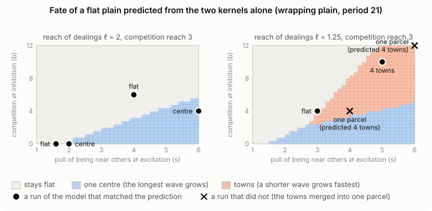

**Firms and homes place themselves.** Two kinds: firms (blue) gain from firms nearby, firms and homes
(orange) need each other. Nothing is pinned, yet the classic monocentric city appears as an outcome: a dense
firm centre with homes around it. On the right, a recurrently connected population forms one hub and the
population that feeds it settles around.

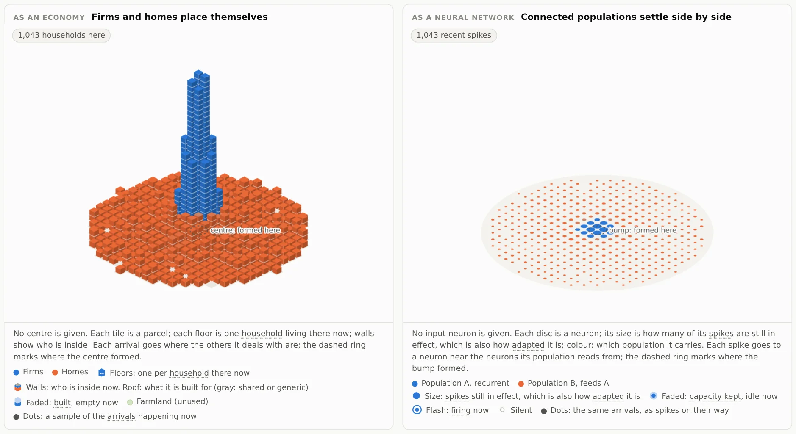

**Several towns.** Turn up spillovers and let firms compete for the same customers over a wider market, and
the one centre breaks into several: each blue cluster is a town's firms, each with homes around it. On the
right, local excitation with longer-range inhibition breaks one hub into modules. Fujita and Ogawa found
these regimes in the 1980s by varying commuting cost against spillovers; here three connection strengths
move between them.

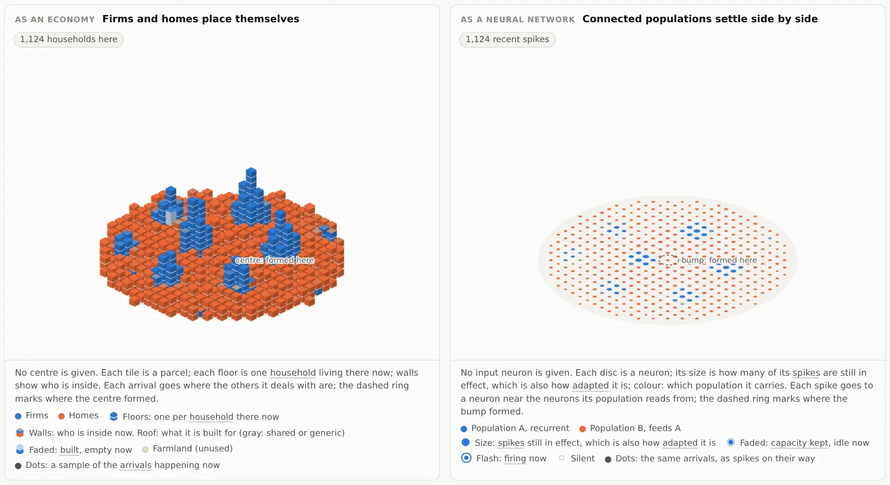

**A port city, a hierarchy.** The one given point is a harbour on the coast ⇄ a sensory input at the sheet's
edge. Docks (blue) deal with the harbour, works (orange) with the docks, homes (green) with the works. Each
kind clusters and the three settle inland in order, the way port cities grew and the way cortical areas sit at
distances from the sensory input that follow their connections. The downtown of the land market was a point;
here it is a population whose place is itself chosen, and so on down the chain. The hops between kinds are
the latency of a forward pass; the readout compares them with the same buildings placed at random (about
half).

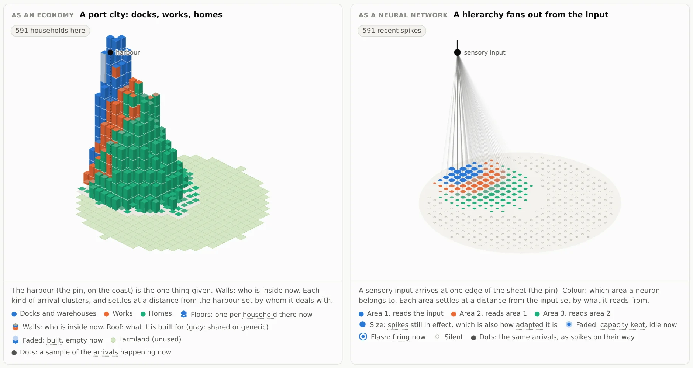

**A coast, then roads and rails.** The one given thing is a coast along the west side (the pale strip),
worth a little. The city starts there. Then it builds: technology grows where people are and spreads inland
(the darker ground), and it changes what people want. It is worth living on in itself; it makes the coast
matter less; and it lengthens the reach of dealings. Early (left) the city hugs the shore; later (right) it
has spread inland and thinned out, yet it stays within a few parcels of the coast. On the right, a sensory
input arrives along one edge of the sheet, and myelin laid down by use is the ground the map stands on.

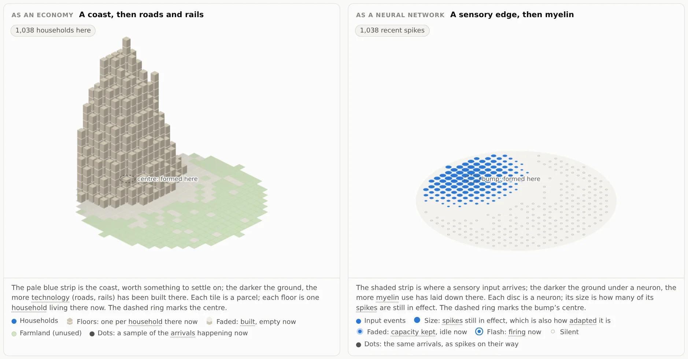

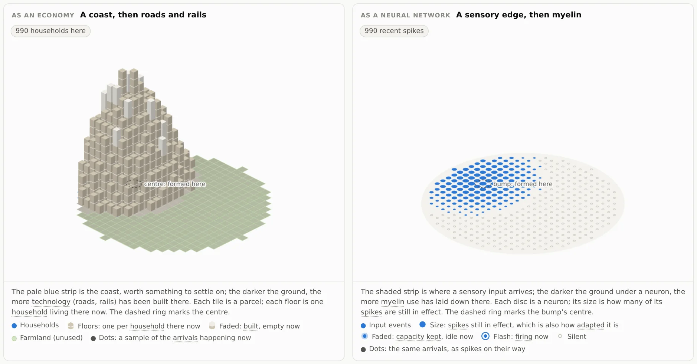

**Freed.** The same run with the made ground worth nothing. Technology still fades the coast, and now
nothing holds the city, so it drifts inland toward the plain's middle: by the end it sits three parcels
farther from the shore than the city above, with a third as many households on the coast. That is Bleakley &
Lin's finding about portage cities turned into a knob: a city stays where geography put it only if what it
built is worth living on ([doc 6 §20](docs/6-derivations.md#20-geography-and-the-geography-people-make)).


**Following one arrival.** The page can pause and walk through a single choice. Here a household adds
its own random taste to every option and picks parcel #223, which wasn't quite the cheapest (cost 7.5
against 7.4). On the right, the neurons race to fire and neuron #223 fires first. These are the same random
process: the logit choice of economics and the softmax of machine learning
([doc 6 §1](docs/6-derivations.md#1-the-logit-is-a-race-of-exponential-clocks)). The small numbers 1–3
mark the three cheapest options.

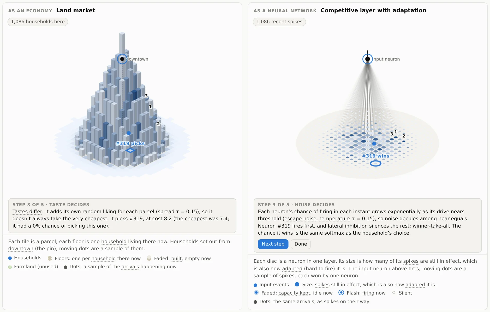

**A height limit is a firing-rate cap.** The dashed outline is the lid. Nothing grows above it, so the
city spreads wider. On the right, no neuron can fire faster than the cap, so more of the sheet lights up.

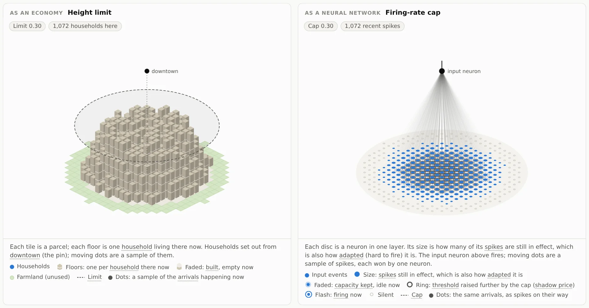

**Sorting.** Two kinds of arrival that differ in how much distance costs them. Offices (blue), which mind
distance most, outbid homes (orange) for the centre: von Thünen's rings. On the right, fast inputs claim
the neurons nearest the input.

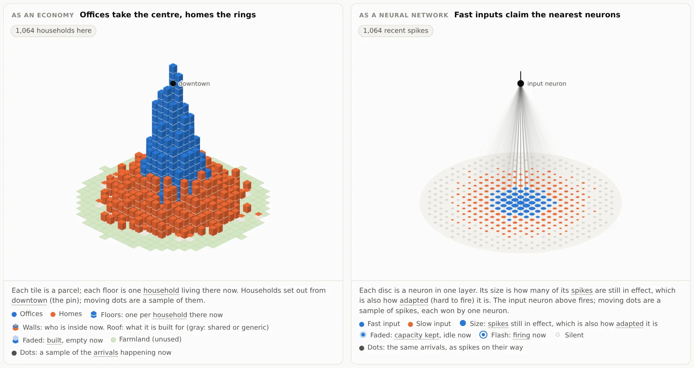

**Districts.** Workers live everywhere and commute to nearby firms, and firms learn from their neighbours.
Patches of one industry form with no plan and no centre. On the right, the same rule grows ocular-dominance
columns, the stripes of left-eye and right-eye neurons in visual cortex.

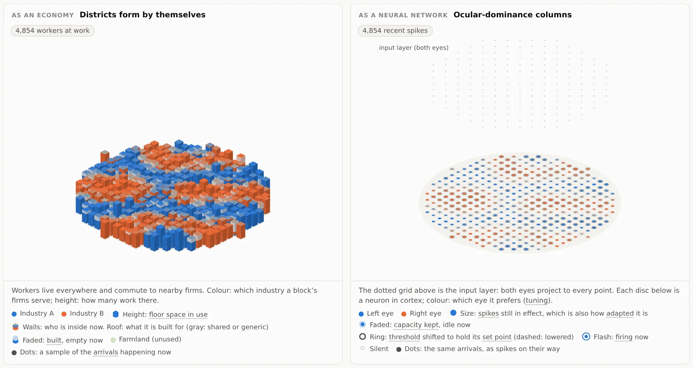

**Mixed use.** Two uses that bother each other when present together, active by day and by night. This is
night: use B (orange) is in, and the pale blue buildings were built for use A, which is away. The same
parcels serve both in turn. On the right, the same neurons serve both features at different times, which
is superposition read as timesharing. Rings mark thresholds still raised from the last shift.

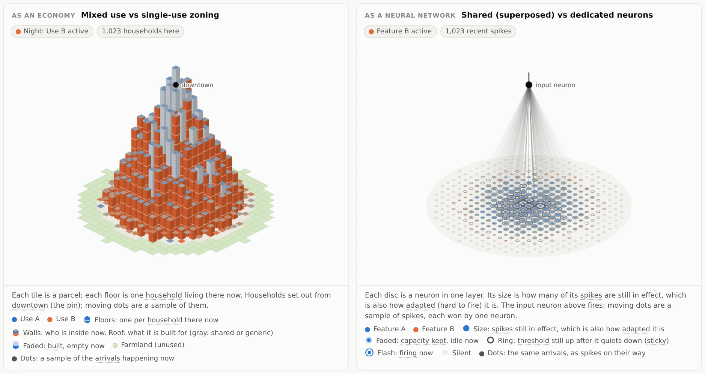

**Firms with fees are a mixture of experts.** Eight firms around a square; each one's fee rises when it's
busier than average. On the right, a router sends tokens to eight experts, and each expert's balancing
bias is the firm's fee with the sign flipped (a fee is subtracted from a deal, a bias added to a score),
moved by the same rule DeepSeek uses.

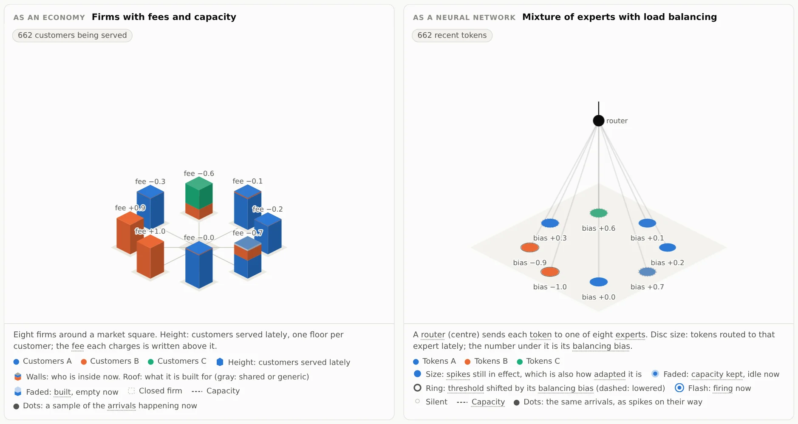

**Commuting is attention.** A corridor of blocks, each a home and a workplace; orange blocks are big
employers. Arcs below are commutes, thicker for more people. On the right, the corridor is a sequence of
tokens and the arcs are attention from each query, falling off with distance the way ALiBi's penalty does.

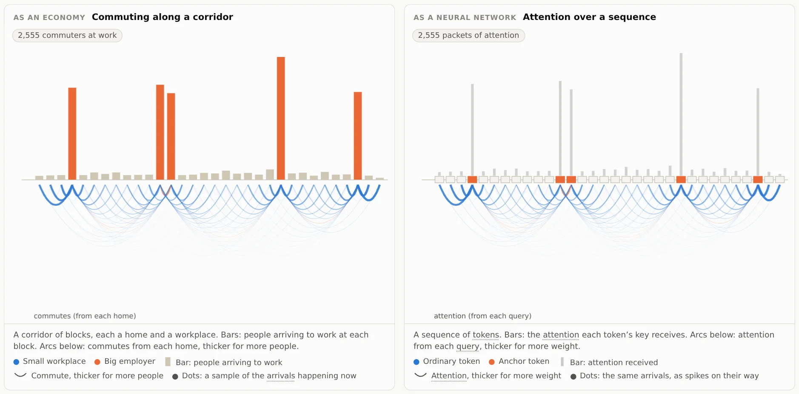

### Three uses that never settle

Not on the page, but drawn from the same model. Three uses share one sheet, and each minds the next: A is
bothered by B, B by C, C by A. A control has the same total dislike spread evenly. Both start mixed and
break apart past a threshold the theory predicts. The control then separates into a fixed pattern and
stops; the cyclic uses keep chasing each other forever, like rock–paper–scissors
([doc 6 §17](docs/6-derivations.md#17-without-a-shared-potential)).

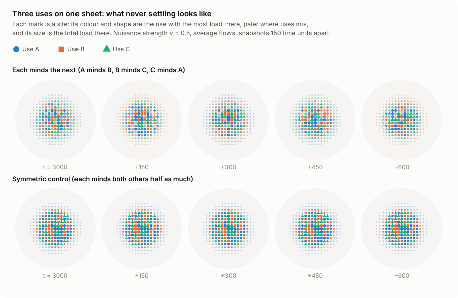

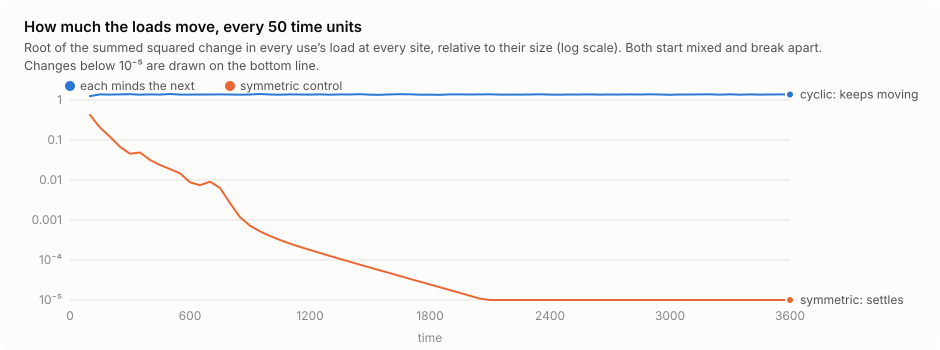

## 3. Learners as economies

[`experiments/learners/`](experiments/learners/) has no interactive page; these figures are drawn from it.

**A learner is a chain of stages.** In a dense network each unit is a firm: it reads the layer below and
sells its output to every unit above, and the last layer is paid by the "customer" (the loss). Prices flow
back, and backprop's signals are those prices. In a market for control each stage is a moment in time:
agents bid to own the world's state, and each owner is paid by the next one
([doc 5](docs/5-learners-as-economies.md)).

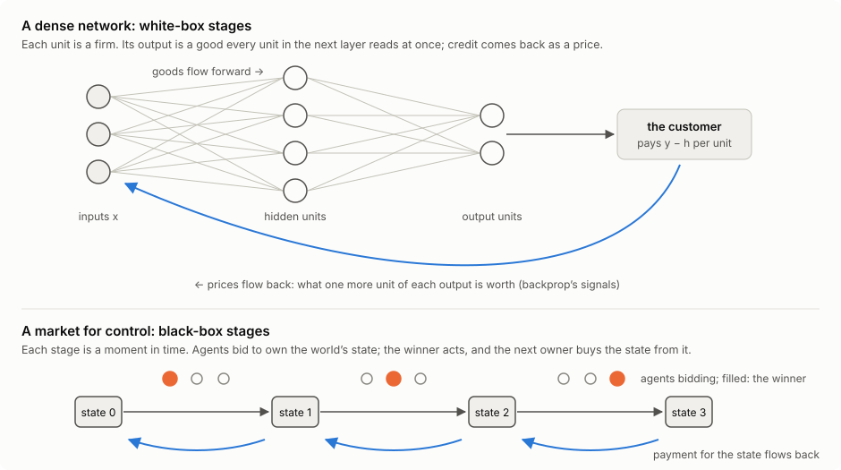

**What a hidden unit is told.** One hidden unit, 80 examples, five ways of paying it. Backprop's honest
price swings from example to example, and that swing is the information that teaches the unit which
feature to compute. Averaging it over examples flattens it. Posted asks only switch on and off with
whether the unit fires. Voluntary payment is zero: nobody pays for an activation they get anyway. Selling
access at its true value gives a noisy estimate of the honest price, right on average but only loosely
matched example by example (correlation 0.33 here), which is still enough to learn from
([doc 6 §13–16](docs/6-derivations.md#13-a-market-for-a-dense-layer-what-a-unit-buys)).

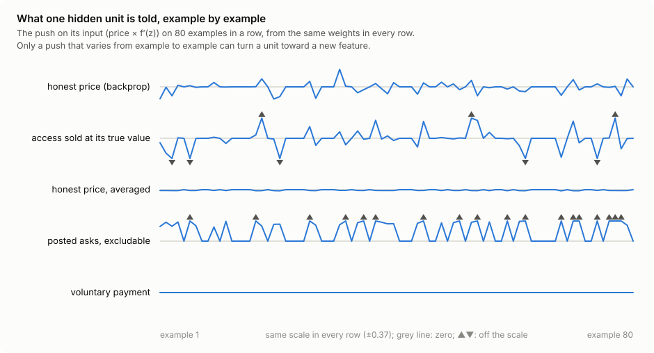

**What that does to learning.** How much better the hidden features got under each design. Only designs
whose price varies by example move far from 1×; posted asks even make tanh features worse.

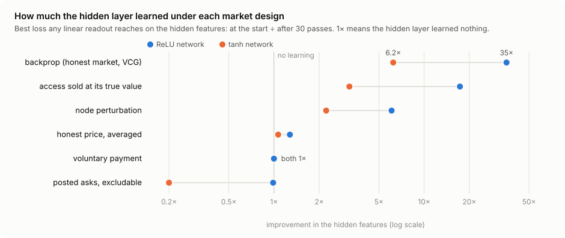

**One price for rationing and credit.** One batch of 64 tokens and four experts with room for 16 each.
Each token's size is what serving it is worth. Every router has to turn 8 tokens away; what differs is
which. Dropping in arrival order throws away average tokens, and dropping by gate probability throws away
somewhat smaller ones. The auction, where each expert bids what it expects to gain, throws away the
smallest. That's the rationing it does better; the doc explains why it assigns credit worse
([doc 5](docs/5-learners-as-economies.md#one-price-for-rationing-and-credit)).

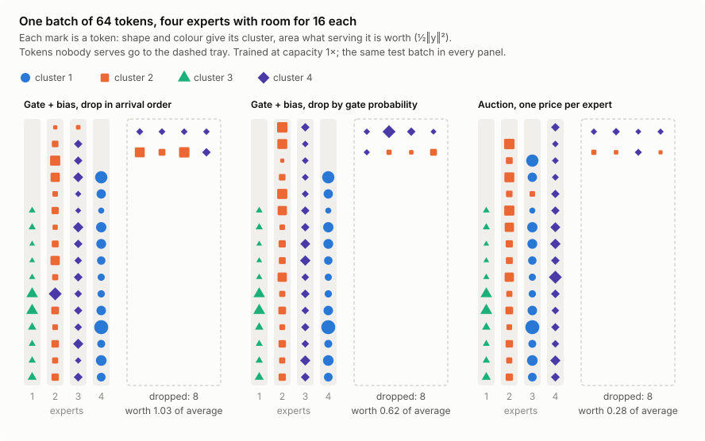

## How these pictures were made

Run from this folder:

```bash
node walkthrough/figures.mjs    # the SVG figures, from the engines (about a minute)
node walkthrough/capture.mjs    # the page screenshots; needs Chromium (CHROME=/path to override)
```

`capture.mjs` serves `experiments/`, drives headless Chromium over its DevTools protocol, steps each
setting with the page's own debug hook, and saves the two views as WebP. The pages run individual agents,
so the screenshots show one moment of a random process. The play-dough page loads three.js from a CDN, so
capturing it needs a network connection.

The figures use the validated light palette from the charting guidelines this was made with: blue, orange,
aqua and violet, with clusters and uses also told apart by shape. The numbers behind each figure are in the
tables of the docs it links to.
